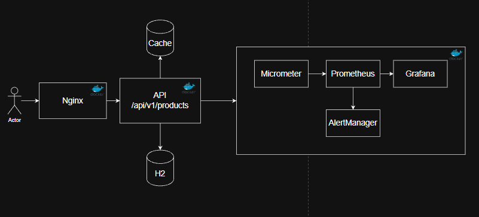

# Teste Técnico: Mercado Livre

---

## 🧰 Tecnologias

- Java 21
- Spring Boot 3.3
- MapStruct
- Caffeine Cache
- Micrometer
- Prometheus
- Grafana
- JUnit 5 / Mockito
- Docker / Docker Compose
---

## Desenho da API

---
## 🏗️ Decisões de Arquitetura

A arquitetura prioriza **baixo acoplamento, clareza de domínio e operação segura em ambientes de produção**.

### 🔹 Separação entre Identidade Técnica e de Negócio
- O ID de banco é tratado como detalhe interno.
- A API expõe apenas **Business Keys** (UUID / Slug).
- Evita vazamento de estrutura interna e facilita futuras migrações.

### 🔹 Modelagem Normalizada de Mídia e Pricing
- Imagens foram modeladas em uma entidade `Media`, separada do produto.
- Uso de `@ElementCollection` para galeria de imagens.
- Decisão focada em **performance de leitura**, reduzindo joins em consultas frequentes.

### 🔹 Categorias com Estrutura Recursiva
- Categorias dos produtos modeladas como árvore.
- Permite geração dinâmica de **breadcrumbs** (hierarquia de categorias) profundas sem redesign do modelo.
  - ex: `produtos > rouparia > masculino > camisetas > camiseta-estampada`

### 🔹 Imutabilidade por Padrão
- Comunicação entre camadas feita exclusivamente via **DTOs imutáveis (Java Records)**.
- Reduz efeitos colaterais e torna o fluxo de dados mais previsível.

---

## ⚙️ Decisões de Implementação e Escalabilidade

### 🚀 Cache Local com Caffeine + Cache Warmer
- Cache aplicado a produtos de alto acesso (pela simplicidade do teste foi escolhido os 30 primeiros).
- Implementado **Cache Warmer no startup**, pré-carregando os produtos mais acessados.
- Isso Evita *cold start* e picos de latência logo após subir a aplicação.
- TTL de 10 minutos . Isso garante que os dados do produto não fiquem obsoletos por muito tempo.
- Eviction baseada em tamanho do cache (40 itens), o Caffeine utiliza um algoritmo (TinyLFU) para remover as entradas que são menos acessadas.

### 🧭 MapStruct para Mapeamento
- Geração de código em tempo de compilação.
- Elimina boilerplate manual.
- Mais performático e seguro que soluções baseadas em reflection.

### 🔒 Open Session in View (OSIV) Desativado
- O Hibernate é fechado após a camada de serviço.
- Força carregamento explícito de dados dentro da transação.                 
- Evita problemas silenciosos de **N+1** em produção.

---

## 🧠 Boas Práticas de Desenvolvimento

- Injeção de dependência via construtor
- Camadas bem definidas (Controller → Service → Repository)
- Tratamento global de exceções  
  → `GlobalExceptionHandler.java`

---

## 📉 Stack de Observabilidade

- **Micrometer → Prometheus → Grafana**
- **Alertmanager** para gerenciamento de alertas.

### 📊 Dashboards Disponíveis

- **Métricas de Negócio**
    - Taxa de busca de produtos (por status)
    - Ratio de buscas `NOT_FOUND`

- **Performance**
    - Latência de busca (p50 / p95 / p99)
    - Throughput HTTP (req/s)

- **Confiabilidade**
    - Erros HTTP 5xx (req/s)

- **Infra / JVM**
    - Uso de Heap (used / max)
    - GC Pause (máximo)
    - Saturação do pool Hikari (active / max)

- **Cache (Caffeine)**
    - Hits vs Misses
    - Taxa de evicção
    - 
### 🚨 Alertas Configurados (Alertmanager)

#### 🔴 Alertas Críticos
- Aplicação fora do ar (todas as instâncias indisponíveis)
- Taxa de erros HTTP 5xx acima do limite aceitável
- Saturação crítica de recursos:
    - Heap acima de 90%
    - Pool de conexões Hikari totalmente utilizado

#### 🟠 Alertas de Warning
- Latência elevada (p95 acima do esperado)
- Pico anormal de erros HTTP 400 / 404
- Taxa elevada de buscas `NOT_FOUND` (alerta de negócio)
- Instância individual fora do ar
- Uso elevado de CPU do processo
- GC Pause elevado (p99)
- Baixa eficiência do cache (Hit Ratio baixo)
- Taxa elevada de evicção do cache

---

## 🧪 Estratégia de Qualidade

A estratégia segue uma pirâmide de testes clara:

### 🔹 Testes Unitários
- JUnit 5 + Mockito
- Foco em regras de negócio e mapeamentos.

### 🔹 Testes de Integração
- `@WebMvcTest` para contratos REST
- `@SpringBootTest` + H2 para persistência

### ⭐ Diferencial: Testes Data-Driven
- Motor de testes (`HttpJsonDynamicUnitTest`) baseado em **JSON**
- Novos cenários podem ser criados sem alterar código Java.
- Facilita colaboração e expansão de testes funcionais.

---

## 🤖 Uso de IA com Governança Técnica

A IA foi usada como **acelerador**, não como decisor.
- Decisões arquiteturais protegidas por um arquivo de `guidelines`
  (ex.: injeção por construtor, visibilidade *package-private*).
- Cada cenario foi usado um caso de uso para a geracao de código. `UC01.md`
- Após cada geração de código, uma revisão manual foi feita.

---

## 🚀 Como Executar

```bash
# Build
mvn clean package

# Infra + Aplicação (ml-product-app)
docker-compose -f src/main/resources/observability/docker-compose.yml up -d

# Rodar multiplas instâncias da aplicação (ex: 3)
docker compose up --scale app=3 -d

#Rebuildar a aplicacao
docker compose up --build --scale app=3 -d

```

## URLs Disponíveis

| Serviço        | Descrição                                       | URL                                      | Usuário | Senha  |
|---------------|-------------------------------------------------|------------------------------------------|---------|--------|
| Swagger        | Documentação da API                             | http://localhost/swagger-ui.html         | —       | —      |
| H2 Console     | Banco em memória (JDBC URL: jdbc:h2:mem:testdb) | http://localhost/h2-console/             | sa      | (vazio)|
| Grafana        | Dashboards e métricas                           | http://localhost:3000/grafana/dashboards | admin   | admin  |
| Prometheus     | Coleta de métricas                              | http://localhost/prometheus/alerts       | —       | —      |
| Alertmanager   | Gestão de alertas                               | http://localhost:9093                    | —       | —      |

  